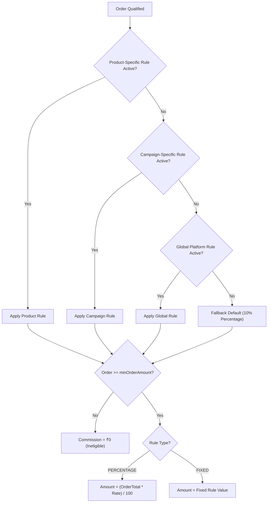
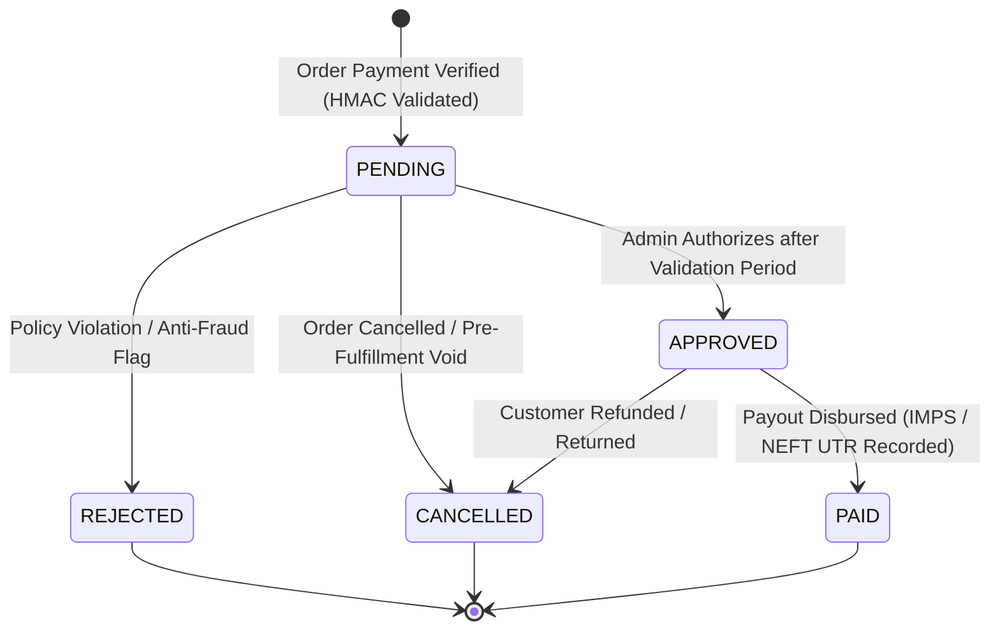

# GAS™ — Grand Affiliate System: Commission Engine Specification

**Module:** GAS™ Commission Engine  
**Version:** 1.0 (MVP)  
**Standard:** Strict Direct-Referral (Single-Tier). Configurable Rules. Zero Client Trust.  
**Brand Principle:** Learn. Earn. Create Value. Get Recognised.

---

## 1. Executive Summary

The **GAS™ Commission Engine** governs affiliate commission calculations, qualification events, validation periods, administrative approvals, cancellations, refunds, and payout disbursements.

### Core Architectural Guarantees:
1. **Zero Client Trust:** Commission amounts, rates, rules, and qualification states are resolved 100% on the server inside atomic database transactions (`$transaction`). Client-supplied amounts are strictly discarded.
2. **Never Premature:** A commission is **never** created when a link is clicked, when a cart is created, or when an unverified checkout is initiated. It is created strictly upon verified cryptographic proof of payment (HMAC-SHA256 signature verification).
3. **Anti-Duplicate Guarantee:** Unique compound checks on `(orderId, referralId)` ensure that duplicate webhook events or repeated qualification attempts cannot create duplicate commissions.
4. **Direct Referral Only (Non-MLM):** Commissions are paid solely to the direct referrer. No multi-level splits, binary matrices, or pyramid overrides exist.

---

## 2. Commission Service Architecture

All commission mutations and calculations are centralized in the single server-side service [`src/lib/services/commission.service.ts`](file:///c:/xampp/htdocs/GAS/src/lib/services/commission.service.ts).

### 2.1 Service Methods

```typescript
class CommissionService {
  // 1. Calculates commission based on product, campaign, or global rule
  calculateCommission(input: CalculateCommissionInput): Promise<CommissionCalculationResult>

  // 2. Qualifies referral on verified payment, prevents duplicates & self-referrals
  qualifyCommission(input: QualifyCommissionInput): Promise<{ isDuplicate: boolean; commission: Commission | null }>

  // 3. Authorizes a pending commission after validation period (PENDING -> APPROVED)
  approveCommission(input: ApproveCommissionInput): Promise<Commission>

  // 4. Rejects a commission with mandatory reason (PENDING/APPROVED -> REJECTED)
  rejectCommission(input: RejectCommissionInput): Promise<Commission>

  // 5. Cancels a commission during lock period or order cancellation (PENDING/APPROVED -> CANCELLED)
  cancelCommission(input: CancelCommissionInput): Promise<Commission>

  // 6. Records disbursement UTR and marks paid (APPROVED -> PAID)
  markCommissionPaid(input: MarkCommissionPaidInput): Promise<Commission>

  // 7. Revokes commissions automatically when an order is refunded
  handleRefund(input: HandleRefundInput): Promise<Commission[]>
}
```

---

## 3. Commission Rule Hierarchy & Types

When an order is qualified, the engine resolves the applicable rule in deterministic order:



### Supported Rule Types:
- **`PERCENTAGE`:** Dynamic calculation based on total order value (e.g. `15%` of `₹5,499 = ₹824.85`).
- **`FIXED`:** Flat monetary amount per qualifying order (e.g. `₹750.00` per sale).
- **Minimum Order Amount (`minOrderAmount`):** Optional threshold below which commission is withheld.
- **Validation Period (`validationDays`):** Default 30-day lock period before payout authorization.

---

## 4. Commission State Machine



### Status Definitions:
- **`PENDING`:** Automatically created upon payment confirmation. Held during validation lock period (e.g. 30 days) to accommodate returns.
- **`APPROVED`:** Authorized by an administrator as payable.
- **`PAID`:** Funds disbursed to affiliate; transaction UTR and date recorded.
- **`REJECTED`:** Denied by administrator due to attribution manipulation or terms violation.
- **`CANCELLED`:** Revoked due to order cancellation or post-purchase customer refund.

---

## 5. Security & Anti-Fraud Controls

1. **Anti-Self-Referral Trap:** If `referrerId === buyerId`, commission creation is aborted, the referral is marked `REJECTED`, and `isFlagged: true` with `flagReason: "Self-referral qualification prohibited"`.
2. **Atomic Idempotency:** The method `qualifyCommission` inspects existing records for `(orderId, referralId)` before inserting. Retried webhooks return the existing record cleanly without creating duplicate financial liabilities.
3. **Immutable Audit Logging:** Every status change (`COMMISSION_QUALIFIED`, `APPROVE_COMMISSION`, `REJECT_COMMISSION`, `CANCEL_COMMISSION`, `DISBURSE_COMMISSION`) writes an immutable record to `audit_logs` capturing actor ID, timestamp, old status, and new status.
4. **Real-Time Member Notifications:** State transitions trigger in-app `Notification` events keeping affiliates informed of pending, approved, and disbursed commissions.

---

## 6. Database Schema Reference

```prisma
model Commission {
  id           String           @id @default(cuid())
  userId       String           @map("user_id")
  referralId   String           @map("referral_id")
  orderId      String           @map("order_id")
  amount       Decimal          @db.Decimal(10, 2)
  status       CommissionStatus @default(PENDING)
  approvedAt   DateTime?        @map("approved_at")
  paidAt       DateTime?        @map("paid_at")
  rejectedAt   DateTime?        @map("rejected_at")
  rejectReason String?          @map("reject_reason") @db.Text
  adminNote    String?          @map("admin_note") @db.Text
  createdAt    DateTime         @default(now()) @map("created_at")
  updatedAt    DateTime         @updatedAt @map("updated_at")

  user     User     @relation(fields: [userId], references: [id])
  referral Referral @relation(fields: [referralId], references: [id])
  order    Order    @relation(fields: [orderId], references: [id])

  @@index([userId])
  @@index([referralId])
  @@index([orderId])
  @@index([status])
  @@map("commissions")
}
```
