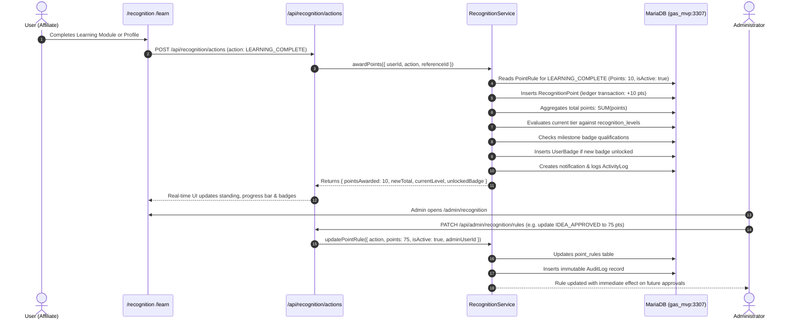

# GAS™ — Grand Affiliate System: Recognition Engine Specification

**Module:** GAS™ Recognition Engine  
**Version:** 1.0 (MVP)  
**Brand Principle:** Learn. Earn. Create Value. Get Recognised.  
**Core Invariant:** Total points are never directly overwritten; every balance change must be an immutable credit in the `recognition_points` ledger.

---

## 1. Executive Summary

The **GAS™ Recognition Engine** provides the reputation, incentive, and gamification infrastructure for the Grand Affiliate System. Designed to complement financial affiliate commissions, the Recognition Engine rewards members for educational progress, ethical referral behavior, platform feedback, and community engagement.

The engine is engineered around three foundational pillars:
1. **Financial-Grade Points Ledger:** Total user points are derived dynamically from the sum of transactions in the `recognition_points` table. Direct mutations of total scores without a ledger record are strictly prohibited.
2. **Configurable Merit Rules:** Initial defaults are established by platform design but are fully configurable by administrators in real-time.
3. **Ascension Tiers & Verified Badges:** Members progress through five structured recognition tiers from **Explorer** to **GAS Champion**, unlocking verified badges along their journey.

---

## 2. Configurable Point Rules

Action rewards are governed by the `point_rules` table. The MVP ships with the following defaults, which can be modified or disabled by administrators via `/admin/recognition`:

| Action Code (`RecognitionAction`) | Action Description | Default Points | Trigger Source |
| :--- | :--- | :---: | :--- |
| **`PROFILE_COMPLETE`** | Full user profile completion | **10 pts** | `/api/recognition/actions` or Profile save |
| **`LEARNING_COMPLETE`** | Curriculum & guide completion | **10 pts** | `/api/recognition/actions` from `/learn` |
| **`REFERRAL_SUCCESSFUL`** | Verified order by referred member | **20 pts** | `/api/payments/verify` |
| **`CONTRIBUTION_APPROVED`** | Verified V2V™ community contribution | **25 pts** | `/api/admin/contributions/[id]` |
| **`IDEA_APPROVED`** | Verified platform innovation idea | **50 pts** | `/api/admin/contributions/[id]` |
| **`COMMUNITY_PARTICIPATION`**| Verified community discussion/mentoring| **10 pts** | Community actions / Admin award |
| **`REGISTRATION`** | Account creation & initial onboarding | **5 pts** | `/api/auth/register` |
| **`PURCHASE`** | Verified direct catalog purchase | **10 pts** | `/api/payments/verify` |

---

## 3. Recognition Tiers & Dynamic Level Calculation

Tier rank is calculated dynamically using cumulative points from the append-only ledger:

$$\text{Total Points} = \sum_{\text{all entries}} \text{points}_{\text{entry}}$$

### 3.1 Milestone Tiers (`recognition_levels`)

| Tier Order | Level Name | Points Threshold | Community Privilege & Standing |
| :---: | :--- | :---: | :--- |
| **Tier 1** | **`EXPLORER`** | 0 – 49 pts | Baseline entry tier for all newly registered members. |
| **Tier 2** | **`CONTRIBUTOR`** | 50 – 149 pts | Active participants who share value or generate initial referrals. |
| **Tier 3** | **`VALUE_BUILDER`** | 150 – 349 pts | Established creators with multiple verified community contributions. |
| **Tier 4** | **`COMMUNITY_BUILDER`** | 350 – 699 pts | Senior mentors eligible for peer review and editorial moderation. |
| **Tier 5** | **`GAS_CHAMPION`** | 700+ pts | Peak standing with VIP recognition, custom badges, and elite status. |

---

## 4. End-to-End Sequence Diagram

---

## 5. Milestone Badges System

Badges are awarded automatically upon qualification and persisted in `user_badges`:

| Badge Name | Condition | Icon / Category |
| :--- | :--- | :--- |
| **Welcome** | Account created & registration verified | Compass / Onboarding |
| **Profile Pro** | 100% profile completed with bio & location | ShieldCheck / Profile |
| **First Referral** | First direct referred user completed purchase | Users / Affiliate |
| **First Purchase** | First confirmed product purchase | ShoppingBag / Customer |
| **V2V Contributor**| First approved community value contribution | Sparkles / V2V |
| **GAS Champion** | Reached 700+ points cumulative ledger standing | Trophy / Elite |

---

## 6. Points Ledger & Security Invariants

1. **No Overwrites Guarantee:**
   - The user profile table (`profiles`) and user table (`users`) do not contain a mutable `totalPoints` column. All point sums are computed via `RecognitionPoint.aggregate({ _sum: { points: true } })`.
   - Every addition or deduction is an append-only transaction in `recognition_points` specifying `action`, `referenceId`, `note`, and timestamp.
2. **Server-Side Authorization:**
   - Administrative rule modifications (`/api/admin/recognition/rules`) and tier adjustments (`/api/admin/recognition/levels`) strictly require `ADMIN` or `SUPER_ADMIN` session roles.
   - Non-admin callers receive an immediate **HTTP 403 Forbidden**.
3. **Audit Trail Accountability:**
   - Every administrative rule change, level adjustment, and manual award creates an immutable entry in `audit_logs` capturing prior state, new state, admin ID, and timestamp.
4. **Action Deduplication:**
   - One-time milestone rewards (e.g., `PROFILE_COMPLETE` or specific `LEARNING_COMPLETE` module IDs) are cross-checked before points issuance to prevent duplicate claims.

---

## 7. Verification & Automated Test Coverage

The Recognition Engine is tested by `test_recognition_engine.js`:
- [x] Points ledger creation without direct total balance overwrites.
- [x] Evaluation of all default point rules (`PROFILE_COMPLETE`, `LEARNING_COMPLETE`, `REFERRAL_SUCCESSFUL`, `CONTRIBUTION_APPROVED`, `IDEA_APPROVED`, `COMMUNITY_PARTICIPATION`, `REGISTRATION`, `PURCHASE`).
- [x] Admin rule configuration & real-time point modification.
- [x] Progressive tier advancement (`EXPLORER` -> `CONTRIBUTOR` -> `VALUE_BUILDER` -> `COMMUNITY_BUILDER` -> `GAS_CHAMPION`).
- [x] Automatic badge unlocks & deduplication in `user_badges`.
- [x] Activity telemetry stream in `activity_logs`.
- [x] Security authorization invariants blocking regular users from admin operations.
