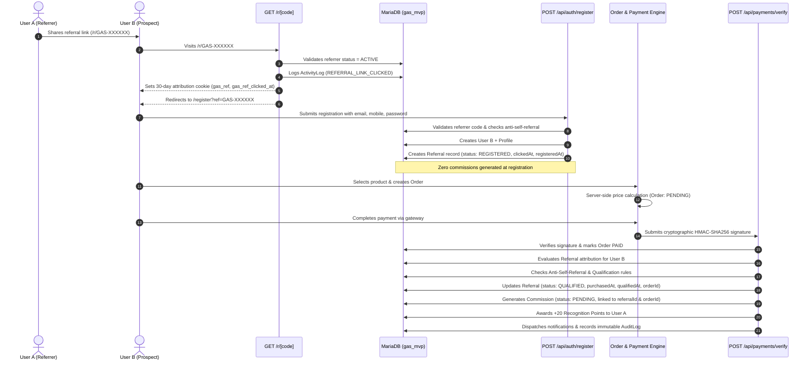

# GAS™ — Grand Affiliate System: Referral Engine Specification

**Module:** GAS™ Referral Engine  
**Version:** 1.0 (MVP)  
**Standard:** Strict Direct-Referral (Single-Tier). No MLM. No Chained Pyramids.  
**Brand Principle:** Learn. Earn. Create Value. Get Recognised.

---

## 1. Executive Summary

The **GAS™ Referral Engine** manages verified member-to-member attributions, tracks engagement telemetry, prevents attribution fraud, and qualifies affiliate commissions upon verified order payments.

The MVP referral architecture strictly enforces a **Single-Tier Direct Referral Model**:
- Affiliate earnings and recognition are credited **exclusively** to the direct referrer who introduced the paying customer.
- Multi-level marketing (MLM), tiered downlines, recruitment matrices, and chained bonus trees are strictly prohibited by code architecture.

---

## 2. Referral Identity & Link Architecture

Every registered user receives an immutable, cryptographically safe referral identity upon account creation.

### 2.1 Identity Format
- **Referral Identifier Code:** `GAS-XXXXXX` (e.g. `GAS-M2UQZM` or `GAS-USER-10245`)
- **Canonical Short Link:** `https://gas.example/r/[code]` (e.g. `http://localhost:3000/r/GAS-M2UQZM`)
- **Direct Registration Link:** `https://gas.example/register?ref=[code]`

---

## 3. End-to-End Referral Lifecycle Flow



---

## 4. Lifecycle State Machine

A direct referral moves through deterministic lifecycle states:

| Status | Trigger Event | Permitted Subsequent States | Commission Impact |
| :--- | :--- | :--- | :--- |
| **`CLICKED`** | Visitor clicks `/r/[code]` short link | `REGISTERED`, `REJECTED` | Zero commission |
| **`REGISTERED`**| Referred member completes account registration | `PURCHASED`, `QUALIFIED`, `REJECTED` | Zero commission |
| **`PURCHASED`** | Order initiated by referred member | `QUALIFIED`, `REJECTED` | Zero commission |
| **`QUALIFIED`** | Server cryptographically verifies order payment | Immutable (Terminal) | Creates dynamic `PENDING` commission |
| **`REJECTED`** | Self-referral, policy violation, or order refund | Immutable (Terminal) | Zero commission / Payout revoked |

---

## 5. Security & Anti-Fraud Architecture

### 5.1 Anti-Self-Referral Prevention
- **Registration Check:** If a registrant attempts to input their own referral code, or if the registrant's email or mobile number matches the referrer's account, the system flags the record:
  - `isSelfReferral = true`
  - `isFlagged = true`
  - `flagReason = "Self-referral detected during registration"`
  - `status = "REJECTED"`
- **Purchase Check:** In `/api/payments/verify`, the server cross-verifies `referral.referrerId !== order.userId`. If self-purchase is detected, qualification is aborted and status transitions to `REJECTED`.

### 5.2 Duplicate Attribution Prevention
- Each user can only be attributed to a single direct referrer upon registration (`User.referredBy`).
- The database enforces referential foreign keys. Multiple registrations with duplicate emails or mobiles are rejected with HTTP 409 Conflict.

### 5.3 Anti-Premature Commission Rule
- Under no circumstances can a commission record be created when a referral link is clicked or when a user registers.
- Commission records are strictly created inside an atomic database transaction (`$transaction`) **only after HMAC-SHA256 signature validation** confirms captured payment funds.

### 5.4 Single-Tier Non-MLM Architecture
- The database relationship `Referral` only connects `referrerId` (Direct) to `referredId` (Direct).
- There are **no recursive trees**, parent-of-parent percentages, or multi-level overrides.
- All commission calculations resolve solely against the direct referrer linked to `referral.referrerId`.

---

## 6. Database Schema & Fields Tracked

```prisma
model Referral {
  id             String         @id @default(cuid())
  referrerId     String         @map("referrer_id")
  referredId     String         @map("referred_id")
  orderId        String?        @map("order_id")
  clickedAt      DateTime?      @map("clicked_at")
  registeredAt   DateTime?      @map("registered_at")
  purchasedAt    DateTime?      @map("purchased_at")
  qualifiedAt    DateTime?      @map("qualified_at")
  status         ReferralStatus @default(REGISTERED)
  isSelfReferral Boolean        @default(false) @map("is_self_referral")
  isFlagged      Boolean        @default(false) @map("is_flagged")
  flagReason     String?        @map("flag_reason") @db.Text
  createdAt      DateTime       @default(now()) @map("created_at")
  updatedAt      DateTime       @updatedAt @map("updated_at")

  referrer    User       @relation("ReferrerUser", fields: [referrerId], references: [id])
  referred    User       @relation("ReferredUser", fields: [referredId], references: [id])
  order       Order?     @relation(fields: [orderId], references: [id])
  commissions Commission[]

  @@index([referrerId])
  @@index([referredId])
  @@index([orderId])
  @@index([status])
  @@map("referrals")
}
```

---

## 7. Verification & Automated Tests

The engine is accompanied by automated test suite [`test_referral_engine.js`](file:///c:/xampp/htdocs/GAS/test_referral_engine.js) executing:
1. **Short Link Click Tracking:** Probes `/r/[code]`, verifies `ActivityLog` telemetry, 30-day attribution cookie, and 307 redirect.
2. **Attributed Registration:** Registers new user using tracking cookie, verifies `Referral` record created with `status: REGISTERED`, `clickedAt`, and `registeredAt`.
3. **Anti-Premature Commission Check:** Asserts exactly zero commissions exist before payment.
4. **Self-Referral Enforcement:** Attempts registration with own code; asserts `isSelfReferral: true`, `isFlagged: true`, and zero commission eligibility.
5. **Purchase Qualification:** Executes order payment verification; asserts status transitions to `QUALIFIED` with `purchasedAt`, `qualifiedAt`, `orderId`, and dynamic `Commission` in `PENDING` state.
6. **Direct Attribution Isolation:** Verifies commission is awarded solely to direct referrer without multi-level cascade.
