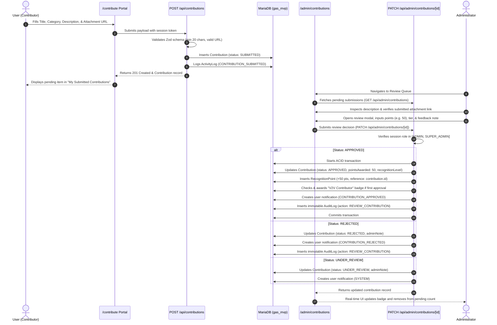

# GAS™ — Grand Affiliate System: V2V™ Value Contribution Engine Specification

**Module:** GAS™ V2V™ (Value-to-Value) Engine  
**Version:** 1.0 (MVP)  
**Brand Principle:** Learn. Earn. Create Value. Get Recognised.  
**Core Cycle:** `LEARN → CREATE VALUE → SHARE VALUE → GET RECOGNISED`

---

## 1. Executive Summary

The **GAS™ V2V™ (Value-to-Value) Contribution Engine** is the meritocratic heart of the Grand Affiliate System. While traditional affiliate networks focus exclusively on transactional sales, GAS™ integrates an educational and collaborative flywheel where users earn community standing, recognition badges, and reputation points by contributing tangible value back to the network.

The platform embodies four interconnected phases:
1. **LEARN:** Users consume affiliate education, platform documentation, and mastery workflows.
2. **CREATE VALUE:** Users formulate innovative ideas, actionable feedback, product improvements, educational guides, and community initiatives.
3. **SHARE VALUE:** Users submit their contributions through structured portal workflows with optional documentation, diagrams, or repository attachments.
4. **GET RECOGNISED:** Submissions undergo strict administrative review. Approved contributions award immutable Recognition Points, unlock verified community badges, and advance members through recognition tiers.

---

## 2. Contribution Categories

Every value contribution must be classified under one of six distinct categories:

| Category Code | Display Name | Scope & Purpose | Base Merit Points |
| :--- | :--- | :--- | :--- |
| **`IDEA`** | Ideas & Innovation | Novel proposals for platform expansion, gamification, and affiliate tooling. | 50 points |
| **`FEEDBACK`** | Platform Feedback | Actionable critiques of user experience, speed, clarity, or workflows. | 25 points |
| **`PRODUCT_IMPROVEMENT`** | Product Improvement | Concrete optimization strategies for catalog items and marketing materials. | 25 points |
| **`EDUCATIONAL_CONTENT`** | Educational Content | Step-by-step tutorials, videos, frameworks, and onboarding walkthroughs. | 25 points |
| **`COMMUNITY`** | Community Initiatives | Local outreach, peer mentoring, study circles, and campus advocacy. | 25 points |
| **`RESOURCE`** | Useful Resources | Swipe copy, design assets, conversion templates, and reference guides. | 25 points |

---

## 3. Contribution Data Model & Schema

Stored in MariaDB (`gas_mvp` on port 3307) via Prisma ORM:

```prisma
model Contribution {
  id               String               @id @default(cuid())
  userId           String               @map("user_id")
  title            String
  description      String               @db.Text
  category         ContributionCategory
  attachmentUrl    String?              @map("attachment_url")
  status           ContributionStatus   @default(SUBMITTED)
  adminNote        String?              @map("admin_note") @db.Text
  pointsAwarded    Int?                 @map("points_awarded")
  recognitionLevel String?              @map("recognition_level")
  reviewedAt       DateTime?            @map("reviewed_at")
  reviewedBy       String?              @map("reviewed_by")
  createdAt        DateTime             @default(now()) @map("created_at")
  updatedAt        DateTime             @updatedAt @map("updated_at")

  user User @relation(fields: [userId], references: [id])

  @@index([userId])
  @@index([status])
  @@index([category])
  @@index([createdAt])
  @@map("contributions")
}
```

### Status Enumeration (`ContributionStatus`)
- **`SUBMITTED`**: Initial state upon member submission. Awaiting administrative review.
- **`UNDER_REVIEW`**: Assigned for editorial verification and quality testing.
- **`APPROVED`**: Verified as genuine value. Merit points credited; contributor notified.
- **`REJECTED`**: Low-effort, duplicate, or violating submissions. Constructive feedback recorded.

---

## 4. End-to-End V2V™ Lifecycle Sequence



---

## 5. Recognition Hierarchy & Progression Tiers

Points awarded through approved V2V™ contributions accumulate into the member's permanent **Recognition Points Ledger** (`recognition_points` table).

### 5.1 Community Standing Levels

| Level Order | Recognition Level | Points Required | Community Badge & Privileges |
| :---: | :--- | :--- | :--- |
| **Tier 1** | **Explorer** | 0 – 49 pts | Baseline entry tier upon account creation. |
| **Tier 2** | **Contributor** | 50 – 149 pts | Unlocked after first approved value contribution or referrals. |
| **Tier 3** | **Value Builder** | 150 – 349 pts | Consistent creator of recognized community assets. |
| **Tier 4** | **Community Builder**| 350 – 699 pts | Senior contributor eligible for peer review moderation. |
| **Tier 5** | **GAS Champion** | 700+ pts | Elite ambassador standing with VIP affiliate commissions. |

### 5.2 Automatic Badge Unlocking
Upon receiving their first approved contribution, the contributor is automatically awarded the **`V2V Contributor`** verified badge (`user_badges` table), accompanied by an instant in-app notification.

---

## 6. Security Invariants & Anti-Self-Awarding Architecture

1. **Strict Server-Side Role Enforcement:**
   - Review operations at `/api/admin/contributions/[id]` inspect NextAuth JWT sessions on the server.
   - Any non-admin attempting to access, review, approve, or reject contributions receives an immediate **HTTP 403 Forbidden**.
2. **Prevention of Self-Awarded Points:**
   - Members cannot pass arbitrary points or modify `pointsAwarded` during submission (`POST /api/contributions`). The submission schema strictly rejects any `pointsAwarded` or `status` fields submitted by clients.
   - The database defaults `pointsAwarded = null` and `status = SUBMITTED`.
3. **Audit Trail Immutability:**
   - Every administrative action is logged to the `audit_logs` table capturing administrator ID, timestamp, prior state, new state, points credited, and IP address telemetry.
4. **Input Sanitization & Length Boundaries:**
   - Title: 5 to 100 characters.
   - Description: Minimum 20 characters, maximum 2,000 characters.
   - Category: Strictly validated against `ContributionCategory` enum.
   - Attachment URL: RFC 3986 standard URL verification or null.

---

## 7. Verification & Automated Test Coverage

The V2V™ Engine is validated under `test_v2v_flow.js` as Suite 4 of the master test suite:

- [x] **Submission Flow:** User submits title, category, description, and attachment URL.
- [x] **Queue Ingestion:** Admin queue displays submission with correct author metadata.
- [x] **Under Review Transition:** Admin places submission into `UNDER_REVIEW` state.
- [x] **Approval & Points Issuance:** Admin approves submission with merit points.
- [x] **Ledger Immutability:** Points credited to contributor; total points recalculation verified.
- [x] **Badge Progression:** "V2V Contributor" badge unlocked upon qualification.
- [x] **Tier Promotion:** Contributor standing elevated based on cumulative ledger score.
- [x] **Rejection Flow:** Admin rejects submission with explanatory critique; zero points credited.
- [x] **Security Protection:** Non-admin callers rejected with HTTP 403 Forbidden.
- [x] **Audit Log Recording:** Audit logs captured with oldValues and newValues diffs.
